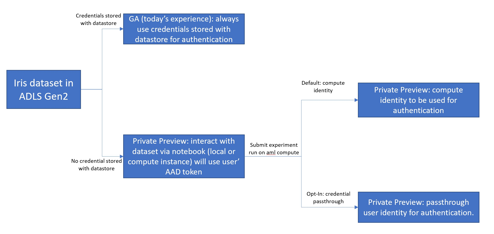

# [Private Preview] identity-based-data-access

This private preview feature aims to:
1. Address the security concern for [AzureML datastore](https://docs.microsoft.com/en-us/azure/machine-learning/how-to-access-data) storing secrets. Today, users have to register datastore with credentials, which is then accessible to anyone with datastore reader role in the workspace. Blob, ADLS Gen1, ADLS Gen2 are supported.
2. Enable eyes-off training. For companies with sensitive data, we make it possible for data scientists to do training without access to the actual data content. You can grant data access to AML compute. So that data scientists won't be able to access or read the data using their own identity but they can still submit experiments to train with the data using compute identity. 
[Sample notebook using estimator](./compute-identity/train-with-estimator/) 
[Sample notebook using pipeline](./compute-identity/multi-step-pipelines/)
3. Enable credential passthrough for granular data access control. For workspace shared by users with different level of data access permission, it is now possible to always authenticate data access with users' AAD token. Admin only needs to manage access control at storage (e.g. adlsgen2). AzureML will passthrough users' AAD token for both interactive experiment and training on remote compute.  
**NOTE**: For private preview, we only support ScriptRun on AML compute* for ADLS Gen2 storage. We will expand support for automl, pipelines in public preview. Whitelisting is reqruied to enable credential passthrough. Please reach out to May Hu (sihhu@microsoft.com) to participate.  
*AML compute (Compute clusters) backed with all VM skus **EXCEPT** the following skus:
    - "standard_nc24r" 
    - "standard_a8" 
    - "standard_a9" 
    - "standard_h16r" 
    - "standard_h16mr" 
    - "standard_nc24rs_v2" 
    - "standard_nc24rs_v3" 
    - "standard_nd24rs" 

    [Sample notebook using Script Run](./user-identity-passthrough/train-with-datasets)

How data access authenticaiton works:

## Terms of Use
This is a private preview feature of Azure Machine Learning and is subject to the [Azure Legal Terms](https://azure.microsoft.com/en-us/support/legal/?ranMID=24542&ranEAID=msYS1Nvjv4c&ranSiteID=msYS1Nvjv4c-pQVqGgzMLX3ysSdCWd8org&epi=msYS1Nvjv4c-pQVqGgzMLX3ysSdCWd8org&irgwc=1&OCID=AID2000142_aff_7593_1243925&tduid=%28ir__6kriqwk10wkftwnk0higqpq2m22xi0gd9xxevzpz00%29%287593%29%281243925%29%28msYS1Nvjv4c-pQVqGgzMLX3ysSdCWd8org%29%28%29&irclickid=_6kriqwk10wkftwnk0higqpq2m22xi0gd9xxevzpz00) and the [Supplemental Terms for Azure Previews](https://azure.microsoft.com/en-us/support/legal/preview-supplemental-terms/) 
